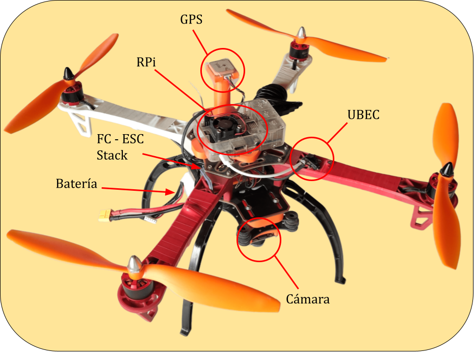
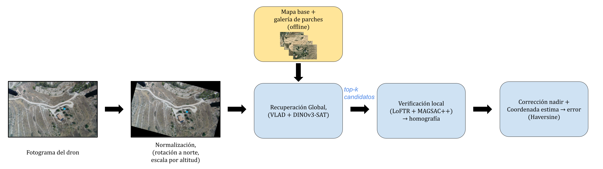
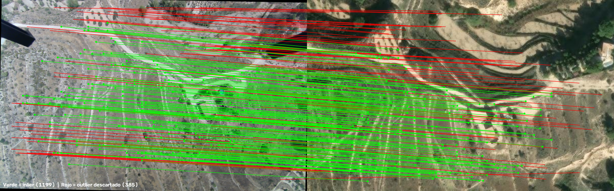

# Diseño e Integración de un Dron para Navegación Autónoma Basada en Visión

Trabajo de Fin de Grado — Grado en Informática Industrial y Robótica (EPSA, UPV).

<p align="center">
  
</p>

Diseño, montaje e integración de un dron cuadricóptero personalizado como banco de
pruebas para Geolocalización Visual Cruzada (CVGL): el dron captura imágenes y
telemetría en vuelo real, y un pipeline de visión (VLAD + DINOv3-SAT para
recuperación global, LoFTR + MAGSAC++ para verificación local) estima su posición
comparando esas imágenes con un mosaico satelital georreferenciado, sin depender
de la coordenada GNSS como entrada.

**Resultados clave** (76 consultas reales sobre un vuelo de validación):

| Top-1 retrieval | Error de localización |    Tiempo por consulta     |
|:---:|:---:|:--------------------------:|
| 89.5 % | 6.1 m (mediana) | 0.4 s (GPU RTX3050 Laptop) |

La memoria completa está en [`memoria_tfg/Documento_maestro.pdf`](memoria_tfg/Documento_maestro.pdf)
y documenta con detalle el diseño, la integración hardware/software, el pipeline
de geolocalización y los resultados experimentales.

## Cómo funciona

<p align="center">
  
</p>

Cada fotograma del dron se normaliza (rotación a norte + escala por altitud),
se compara contra una galería de parches satelitales mediante un descriptor
global (VLAD + DINOv3-SAT), y el candidato ganador se verifica geométricamente
con emparejamiento local (LoFTR + MAGSAC++) para estimar la posición final:

<p align="center">
  
</p>

*Correspondencias entre un fotograma real del dron y el parche satelital ganador: en verde los emparejamientos válidos (inliers) tras el filtrado geométrico con MAGSAC++.*

## Estructura del repositorio

```
codigos_dron/            Script de producción que corre en la Raspberry Pi
                          embarcada: captura de cámara + telemetría MAVLink
                          en hilos independientes (capturar_vuelo.py).

codigos_final/            Pipeline de producción de geolocalización visual (CVGL)
├── principal/             Scripts numerados 01-12: desde la descarga del
│                           mosaico satelital hasta las gráficas de resultados
│                           finales. Ver la Tabla A.1 de la memoria (Anexo A).
└── graficos/               Gráficas ya generadas, usadas en la memoria.

memoria_tfg/              Memoria completa en LaTeX (plantilla tfgepsa, UPV)
                          y el PDF ya compilado.

dinov3_repo/               (no incluido, ver más abajo) clon oficial de
                            facebookresearch/dinov3, necesario para cargar
                            los backbones DINOv3 vía torch.hub.
dinov3_weights/             (no incluido, ver más abajo) pesos .pth de DINOv3.
```

## Puesta en marcha

### 1. Entorno Python

```bash
python -m venv .venv
.venv\Scripts\activate        # Windows
pip install -r requirements.txt
```

`torch`/`torchvision`/`torchaudio` se instalaron con la rueda CUDA 12.1:

```bash
pip install torch==2.5.1 torchvision==0.20.1 torchaudio==2.5.1 --index-url https://download.pytorch.org/whl/cu121
```

Si no tienes GPU NVIDIA, instala en su lugar las versiones CPU estándar de esos
tres paquetes.

`codigos_dron/` (el script que corre en la Raspberry Pi embarcada) tiene una
dependencia adicional no incluida en `requirements.txt` porque no forma parte
del entorno de análisis: `pymavlink` (además de `opencv-python`, ya incluido).

### 2. DINOv3 (backbone del descriptor de recuperación global)

No se incluyen en este repositorio ni el repo de DINOv3 ni sus pesos, por
tamaño y por estar los pesos bajo licencia de acceso restringido de Meta.
`codigos_final/principal/descriptor_produccion.py` espera encontrarlos como
carpetas hermanas de este repositorio:

```bash
git clone --depth 1 https://github.com/facebookresearch/dinov3 dinov3_repo
```

Los pesos (`dinov3_vitb16_pretrain_lvd1689m-*.pth` y
`dinov3_vitl16_pretrain_sat493m-*.pth`, esta última es la variante de
producción) se solicitan y descargan desde la página oficial de Meta:
<https://ai.meta.com/resources/models-and-libraries/dinov3-downloads/>.
Colócalos en una carpeta `dinov3_weights/` también hermana de este repositorio.

### 3. Reproducir el pipeline CVGL

Los scripts de `codigos_final/principal/` están numerados en orden de
ejecución (01 → 12); el detalle de cada uno está en la Tabla A.1 de la
memoria (Anexo A). En resumen:

1. `01_download_basemap.py` — descarga el mosaico satelital georreferenciado.
   `LAT_CENTER`/`LON_CENTER` están a `0.0` como placeholder (las coordenadas
   reales de la zona de vuelo no se incluyen en el repositorio por
   privacidad); sustitúyelas por las coordenadas de tu propia zona antes
   de ejecutar.
2. `02_tile_basemap_gallery.py` — genera la galería de parches.
3. `10_preparar_queries_vuelo_completo.py` — normaliza los fotogramas de un vuelo (rotación a norte + recorte por altitud).
4. `11_ejecutar_vuelo_completo.py` — ejecuta el pipeline completo y calcula el error de localización.
5. `12_graficos_resultados.py` — genera las gráficas de resultados.

## Scripts de experimentación (no publicados)

Además del pipeline de producción, el proyecto incluye una carpeta `pruebas/`
con los scripts usados para comparar alternativas antes de fijar la
configuración final (backbones, agregación, calibración de cámara,
optimizaciones de LoFTR, barrido de parámetros del mosaico) y con los
prototipos previos al script de captura definitivo. Esta carpeta no se sube
al repositorio: es código de usar-y-tirar, sin el mismo nivel de cuidado que
`codigos_final/principal/`, y depende de datos intermedios pesados que
tampoco se publican. Su contenido y resultados ya están documentados en el
Anexo A (Tabla A.2) y en el Capítulo 8 de la memoria. Si a alguien le
interesa el código en sí, que lo pida sin problema.

## Datos no incluidos en el repositorio

Por tamaño y privacidad, no se incluyen en git (quedan solo en el entorno de
desarrollo original, ver `.gitignore`):

- Los datos crudos de los vuelos reales (imágenes + `telemetria.csv`).
- Los artefactos intermedios regenerables del pipeline (mosaico `basemap.tif`,
  parches de la galería, embeddings/caché `.npz`, `vlad_codebook*.npy`) —
  se reconstruyen ejecutando los scripts numerados de `codigos_final/principal/`.
- Los CSV de índice y resultados (`gallery_index.csv`, `queries_index_completo.csv`,
  `resultados_vuelo_completo.csv`), por contener coordenadas GPS reales de la
  zona de vuelo — también se regeneran al ejecutar el pipeline.

## Licencia

Este código se distribuye bajo licencia [MIT](LICENSE): libre para usar,
modificar y redistribuir, incluso con fines comerciales, siempre citando la
autoría original. `dinov3_repo/` (no incluido) se distribuye bajo su propia
licencia, ver el repositorio oficial de Meta.

La memoria (`memoria_tfg/`) se distribuye bajo Creative Commons
Reconocimiento (CC BY 4.0).
